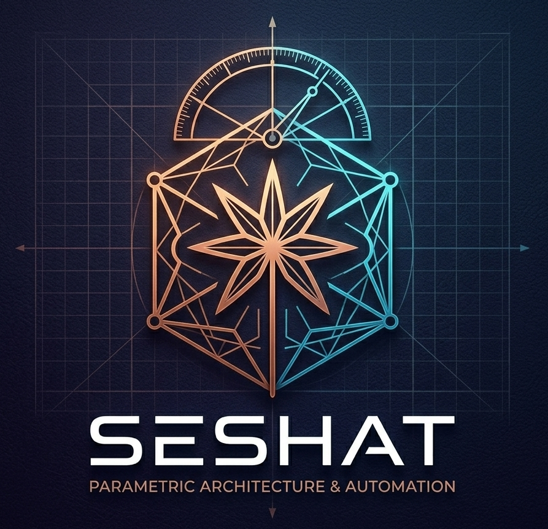

# Seshat — AI-Powered Revit Co-Architecture Assistant

> *Seshat is the ancient Egyptian goddess of architecture and measurements. This plugin brings her into Autodesk Revit.*

Seshat is an intelligent Autodesk Revit add-in that accepts plain English instructions and executes them directly against the Revit API. It is not a chatbot — it is a working co-design assistant that places elements, reads floor plans, generates parametric designs, and manages your family library, all from natural language commands.

Built in **C# / .NET 8** in collaboration with **Claude AI by Anthropic**.

---

## What Seshat Does

Seshat has two modes of operation:

**Normal Mode** — precise BIM control through plain English. Tell Seshat what to place, where, with what parameters, and it executes directly in your Revit model.

**Design Mode** — generative and parametric design. From floor plan layout suggestions to Zaha Hadid-style parametric facades, Seshat can generate, iterate, and refine architectural forms from your descriptions and preferences.

---

## The Six Departments

### Department 1 — Tasks Creation
The core BIM command engine. Communicate with Revit in plain English.

- Place walls, floors, doors, windows, roofs, columns, and beams with full parameter control
- Specify type, dimensions, location, orientation, level, material, base and top offsets — all in one instruction
- Structural elements support both height and depth specifications
- Place columns on specific grid intersections by name
- All Revit element categories supported and continuously expanding

**Example commands:**
```
"Place a 200mm concrete wall, 8 meters long, on Level 2"
"Add a Basic Roof with a 30-degree slope over the Level 1 footprint"
"Place columns on grid intersections A1, A2, B1, B2 with a height of 4 meters"
"Add a curtain wall 12 meters wide and 6 meters tall at coordinates (0, 0, 0)"
```

---

### Department 2 — Floor Plan Reading and Layout Suggestions
Seshat reads your existing floor plan and becomes your spatial design consultant.

- Analyses a flat floor plate and suggests room layouts based on your brief
- Considers natural light, views, circulation, and spatial relationships
- Supports multiple layout iterations — provide feedback and Seshat refines
- Handles residential, commercial, and mixed-use programmes
- Optimises space use against user-defined constraints

**Example commands:**
```
"Suggest a layout for a 120sqm apartment with 3 bedrooms, 2 bathrooms, and an open living area"
"Redesign the office floor for 40 workstations with 2 meeting rooms and a kitchen"
"Adjust the previous layout to improve natural light in the bedrooms"
```

---

### Department 3 — Parametric Design (NURBS & Generative)
The advanced design engine for architects who think beyond rectangular geometry.

- Create parametric designs from basic geometric primitives — circles, polygons, curves
- Generate parametric facades with complex patterns and materials (hexagonal grids, Voronoi diagrams, fractals)
- Generative design mode — specify constraints and Seshat generates multiple design options
- Photo combination — upload two reference images and Seshat synthesises hybrid design concepts
- Machine learning-informed iteration — Seshat learns your design preferences over a session
- Full NURBS geometry support through Dynamo integration

**Example commands:**
```
"Create a parametric facade with a Voronoi pattern using glass panels"
"Generate 3 design options for a canopy with a maximum span of 12 meters"
"Create a fractal facade pattern at depth level 4 using concrete and steel"
"Combine these two reference images into a facade concept"
```

---

### Grids and Levels
Dedicated grid and level creation from natural language input.

```
"Create a 6x8 column grid at 5-meter spacing starting at the origin"
"Add levels at 0, 4, 8, 12, and 16 meters and name them Ground through Level 4"
```

---

### Family Library Browser
Intelligent family search and loading across your local Revit library.

- Recursive folder search across any local directory
- Keyword-based search across family names and types
- Thumbnail preview panel — browse visually before loading
- One-click load directly into the active project
- User-selectable search root folders

---

### Conversation Memory
Seshat maintains a running session memory of your instructions, choices, and placed elements. Clear it at any time to start a fresh design conversation without previous context affecting new commands.

---

## Technical Stack

| Layer | Technology |
|---|---|
| Plugin framework | C# / .NET 8 / Revit API 2026 |
| UI | WPF — full dialog system with light and dark theme |
| AI engine | Claude AI by Anthropic — natural language → JSON → Revit API |
| Parametric geometry | Dynamo for Revit integration |
| Command parsing | Custom JSON command schema with structured parameter extraction |
| Compatibility | Autodesk Revit 2024 / 2025 / 2026 |

---

## Design Philosophy

Most Revit automation tools give you more buttons. Seshat gives you a conversation.

The goal is to remove the gap between what an architect can imagine and what Revit can execute. Instead of navigating menus and dialogs, you describe what you want — in the same language you would use with a colleague — and Seshat handles the translation into Revit actions.

The two modes — Normal and Design — reflect how architects actually work: with precision when documenting, with freedom when exploring.

---

## Project Status

Seshat is under active development. Current stable modules:

- [x] Tasks Creation — walls, floors, doors, windows, columns, beams, roofs
- [x] Grids and Levels creation
- [x] Family Library browser with thumbnail preview
- [x] DWG Tracer — automatic CAD layer to Revit element conversion
- [x] WPF UI with light/dark theme
- [ ] Floor plan layout suggestions (in development)
- [ ] Parametric facade generator (in development)
- [ ] Photo combination module (planned)

---

## About the Developer

**Moataz ElSherbini** — Independent Software Architect & BIM Developer, Cairo, Egypt.

23 years of software development across Revit plugin development, Excel automation, and full-stack web applications. Available for custom Revit plugin development and BIM automation projects.

- LinkedIn: [linkedin.com/in/moataz-elsherbini-8916b61a](https://linkedin.com/in/moataz-elsherbini-8916b61a)
- Email: moataz.elsherbini@live.com
- Available for custom Revit plugin development — [message me on LinkedIn](https://linkedin.com/in/moataz-elsherbini-8916b61a)

---

*Built with Claude AI by Anthropic · Autodesk Revit 2026 · C# .NET 8*
